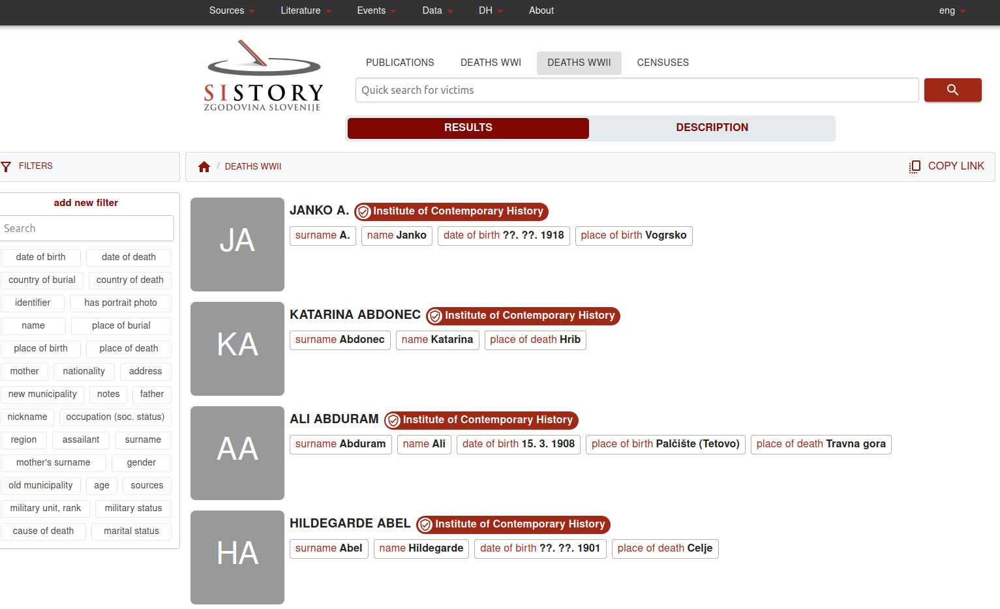
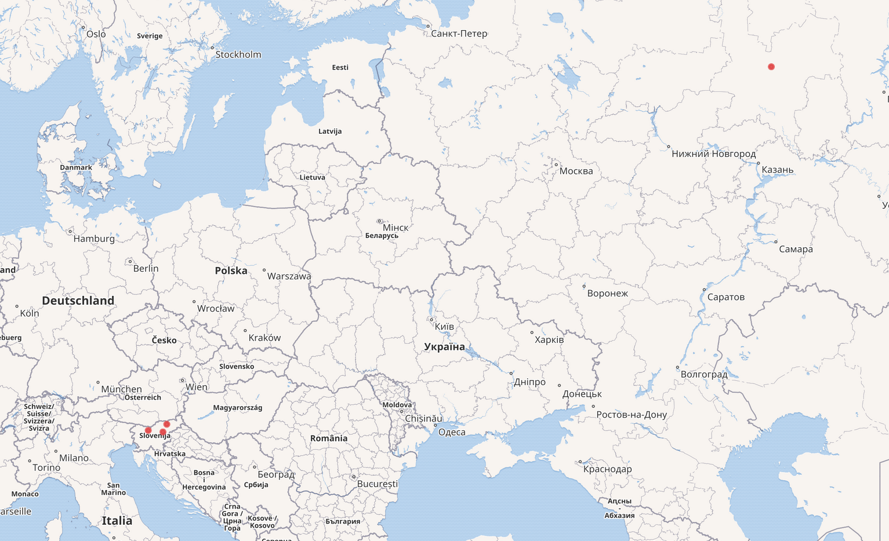

# Fellowship-Institute-of-Contemporary-History-Slovenia-2026

This repository contains the information concerning the [Visiting Fellowship 2025/26 (March 2026) at the Institute of Contemporary History in Ljubljana](https://inz.si/gostujoci-raziskovalec/gustavo-candela-phd/). It describes the main goals and outputs of the fellowship.


## Lecture - Wednesday, March 11, 2026
[Data Publishing and Use in the Humanities: A Labs Approach](https://dariah.si/history-on-the-edge-data-publishing-and-use-in-the-humanities-a-labs-approach/)

This presentation will introduce the publication and use of digital collections in the humanities following best practices and guidelines promoted by the International GLAM Labs Community and Collections as data initiatives. It will describe previous and ongoing work concerning the employment of reproducible code and workflows to reuse a wide diversity of content including metadata, bibliographic records or images. It will also present advanced techniques based on information retrieval, visualisation, data quality and enrichment with external repositories. Existing data research infrastructures and platforms in Europe will be outlined.

## Datasets

A selection of digital collections are available at [https://dariah.si/projects/research-data-collections/](https://dariah.si/projects/research-data-collections/), in particular, the [Database of Victims of the Republic of Slovenia during and immediately after the Second World War](https://sistory.si/eng/ww2?t=desc). The list, containing more than 100,000 persons, is a systematic inventory of military and civilian persons who had residency rights in the territory of today's Republic of Slovenia during World War II and immediately after (May 1940 − January 1946) and lost their lives due to wartime and post-war (revolutionary) violence or consequences of war.



## Examples of records

These records were extracted manually from the website and linked to Wikidata.

- https://sistory.si/eng/ww2/CE087EAC-BF00-4948-AA8D-BA678EB4E05D (place of death Hrib: https://www.wikidata.org/wiki/Q2055580)
- https://sistory.si/eng/ww2/055BE140-1B85-4572-BE94-6D5798EB6524 (place of death Travna gora: https://www.wikidata.org/wiki/Q2058146)
- https://sistory.si/eng/ww2/2D461E96-1274-46FE-895B-133250653872 (place of death Celje: https://www.wikidata.org/wiki/Q1012)
- https://sistory.si/eng/ww2/E4D233E0-AF3B-4A76-90C9-CBBC97680632 (place of death Resnik, Pohorje: https://www.wikidata.org/wiki/Q218853)
- https://sistory.si/eng/ww2/1C5D7D68-A4E8-4E83-9DF3-C003B5161780 (place of death Kajski rajon, Kirovska oblast: https://www.wikidata.org/wiki/Q5387)

As a result, we can create a simple visualisation using the [Wikidata SPARQL endpoint](https://w.wiki/JH3F):

```
#defaultView:Map      
select ?s ?sLabel ?coord ?image 
where {
     values ?s {wd:Q2055580 wd:Q2058146 wd:Q1012 wd:Q218853 wd:Q5387}
      ?s wdt:P625 ?coord .
      ?s wdt:P18 ?image
   
  SERVICE wikibase:label { bd:serviceParam wikibase:language "[AUTO_LANGUAGE],es". }
}
```


## Using LLM to enrich the data

Using the following prompt 

* extract 100 real SIstory records with their identifiers and death places. Then, get the Wikidata identifier for each record. then create a SPARQL query to retrieve the information from Wikidata. Finally, export the information to a JSON file including the SIstory record and the wikidata id, one per line.

And we retrieved:

| SIstory ID                           | Person          | Place of death                  |
| ------------------------------------ | --------------- | ------------------------------- |
| 011E344F-9DBC-488E-8629-7C41B1B4E839 | Ivan Slovša     | Renicci                         |
| 19BAEF80-CF57-4BA0-BE6F-CC553AC7399F | Alojzij Smrtnik | Renicci                         |
| A7569C1D-ED16-4A55-B2FC-85939C845EA1 | Franc Setnikar  | Rab                             |
| 9759CE3A-0AEA-4A9B-B08A-243670F9F243 | Alojzij Fink    | Sv. Urh                         |
| 7298E7BA-36A7-4D31-84EF-DE796EEBB3D6 | Jože Šteblaj    | Pri Zapotoku                    |
| FC33D83B-ED5A-4D16-9AD6-A53E4ADC8635 | Andrej Kikelj   | Zapotok                         |
| EBFC9211-7988-400A-8E4B-7E26FC0A5F32 | Franc Morgan    | Grintovec                       |
| 8EBF8538-E9D2-4BD3-BA60-E85836E1A145 | Ciril Korenčan  | Zaklanec                        |
| 94040234-586E-4116-B19F-20BDC326BB2E | Ciril Pivk      | Dobrava pri Polhovem Gradcu     |
| 96E70AAC-3A55-4A05-B566-4417B7C2A6BF | Janez Češnovar  | Srednja vas pri Polhovem Gradcu |
| C6EC7DF1-34A4-40F2-B55C-9A67DDF015FF | Marija Zorko    | Ravensbrück                     |
| 02A5236D-2E43-44EF-949D-2307FB5292D5 | Jožef Švab      | pri Rakitovcu                   |


We ask for a SPARQL query to retrieve the information: https://w.wiki/JH3e

```
#defaultView:Map
SELECT ?place ?placeLabel ?typeLabel ?countryLabel ?coord WHERE {
  VALUES ?place {wd:Q3654688 wd:Q728524 wd:Q12755588 wd:Q831488 wd:Q5618291 wd:Q1592686 wd:Q5288496 wd:Q7600850 wd:Q152701 wd:Q2069044}

  OPTIONAL { ?place wdt:P31 ?type }
  OPTIONAL { ?place wdt:P17 ?country }
  OPTIONAL { ?place wdt:P625 ?coord }

  SERVICE wikibase:label { bd:serviceParam wikibase:language "en,sl". }
}
ORDER BY ?placeLabel
```

And we repeat the process but in this case for 100 locations and create a visualisation.


And export the data as a [JSON file](data/death-locations.json).

## Ideas

- [Datasheets for Digital Cultural Heritage Datasets](https://doi.org/10.5281/zenodo.15828222)
- Visualisations (e.g., maps and charts)
- Enrichment with external repositories (e.g., Wikidata)
- New section in the website as GLAM Labs (e.g., see the [Data Foundry at the National Library of Scotland](https://data.nls.uk/))
- Examples of use based on reproducible code and Jupyter Notebooks (e.g., see https://doi.org/10.1002/asi.24835)
- API access
- Integration with European infrastructures (e.g., ECCCH and EOSC)
- Open Access practices: Zenodo, Social Sciences and Humanities Open Marketplace, OpenAIRE
- Measure the quality of the data available and generated

## References

- Internal database of the Institute of Contemporary History (INZ): Tadeja Tominšek Čehulić, Mojca Šorn, Marta Rendla, Dunja Dobaja, Tamara Logar: Death Victims Among the Population in the Territory of the Republic of Slovenia During World War II and Immediately After [Collection].
- https://inz.si/gostujoci-raziskovalec/gustavo-candela-phd/
- https://dariah.si/history-on-the-edge-data-publishing-and-use-in-the-humanities-a-labs-approach/
- Gustavo Candela. 2025. Browsing Linked Open Data in Cultural Heritage: A Shareable Visual Configuration Approach. J. Comput. Cult. Herit. 18, 1, Article 9 (March 2025), 15 pages. https://doi.org/10.1145/3707647
- Candela, G. (2023). An automatic data quality approach to assess semantic data from cultural heritage institutions. Journal of the Association for Information Science and Technology, 74(7), 866–878. https://doi.org/10.1002/asi.24761
- Candela, G., Chambers, S., Irollo, A., Freire, N., Dritsou, V., Isaac, A., Benardou, A., Garnett, V., & Tasovac, T. (n.d.). A Workflow to publish Collections as Data: looking back at Europeana.eu and forward to the common European data space for cultural heritage (Version 1, Vol. 965). Transformations: A DARIAH Journal . https://doi.org/10.46298/transformations.14774
- Candela, G., Rosiński, C., & Margraf, A. (2025). A reproducible framework to publish and reuse Collections as data: the case of the European Literary Bibliography (Version 4, Vol. 965, Issue 170). Transformations: A DARIAH Journal . https://doi.org/10.46298/transformations.14729
- Candela, G., Cuper, M., Holownia, O., Gabriëls, N., Dobreva, M., Mahey, M. (2024). A Systematic Review of Wikidata in GLAM Institutions: a Labs Approach. In: Antonacopoulos, A., et al. Linking Theory and Practice of Digital Libraries. TPDL 2024. Lecture Notes in Computer Science, vol 15178. Springer, Cham. https://doi.org/10.1007/978-3-031-72440-4_4
- Gustavo Candela, Sally Chambers, Tim Sherratt: An approach to assess the quality of Jupyter projects published by GLAM institutions. J. Assoc. Inf. Sci. Technol. 74(13): 1550-1564 (2023)
